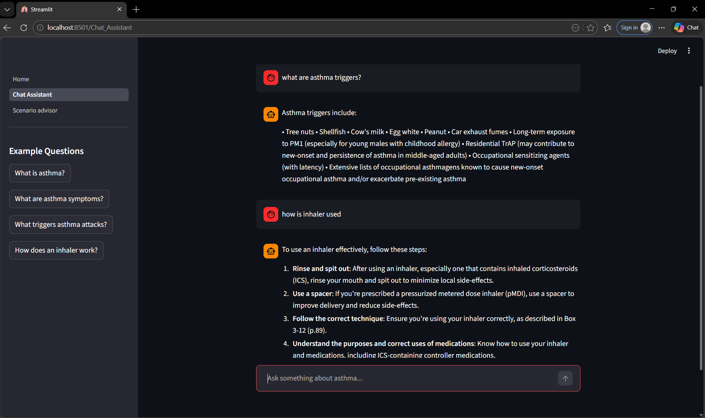
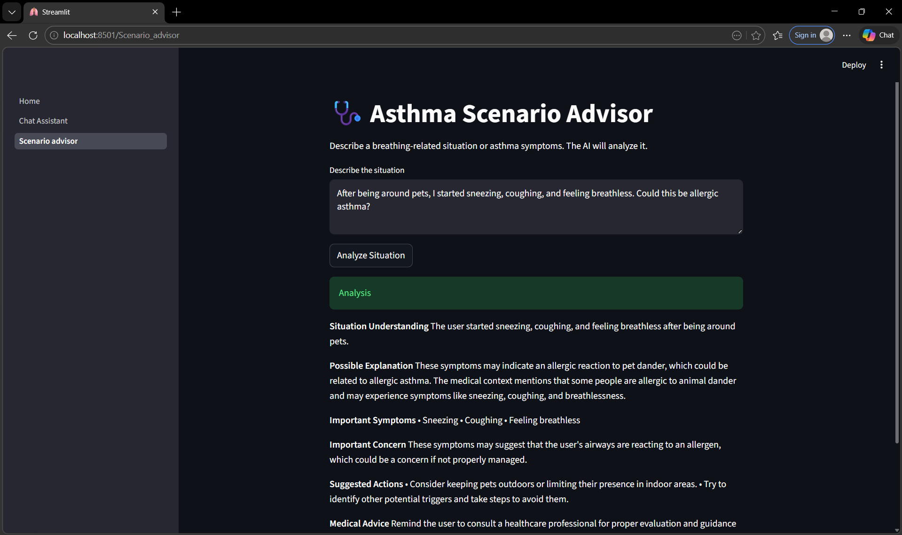

# 🫁 Asthma Medical AI Assistant

An intelligent **RAG-based AI system** designed to answer asthma-related medical queries using trusted medical documents, hybrid retrieval techniques, and LLM-based response generation.

---

## 🚀 Features

* 🔍 Retrieval-Augmented Generation (RAG)
* ⚡ Hybrid Search:

  * BM25
  * TF-IDF
  * Vector Search (FAISS)
* 🧠 Query Processing:

  * Bigram Model
  * Query Expansion
  * HyDE
* 🤖 LLM Integration (Groq)
* 🛡️ Safety Guardrails
* 💬 Interactive UI (Streamlit)

---

## 🧠 Architecture

User Query
→ Query Processing
→ Hybrid Retrieval (BM25 + TF-IDF + Vector)
→ Context Builder
→ LLM (Groq)
→ Response

## 📸 Demo

### Chat Assistant


### Scenario Advisor


## ⚙️ Tech Stack

* Python
* Streamlit
* FAISS
* BM25
* TF-IDF
* Groq API

---

## ▶️ How to Run

```bash
git clone https://github.com/Eshaagoyal/Asthma-Medical-AI-Assistant.git
cd asthma-rag-ai

python -m venv venv
venv\Scripts\activate

pip install -r requirements.txt
streamlit run Home.py
```

---

## 💡 Example Queries

* What are asthma triggers?
* How to manage asthma attack?
* Difference between allergic and non-allergic asthma?

---

## 🔥 Why This Project is Unique

* Combines **BM25 + TF-IDF + Vector search** (Hybrid RAG)
* Uses **query expansion + HyDE** for better retrieval
* Domain-specific **medical assistant**
* Includes **safety guardrails**

---

## ⚠️ Disclaimer

This project is for educational purposes only and not a substitute for professional medical advice.

---

## 👩‍💻 Author

Esha Goyal
